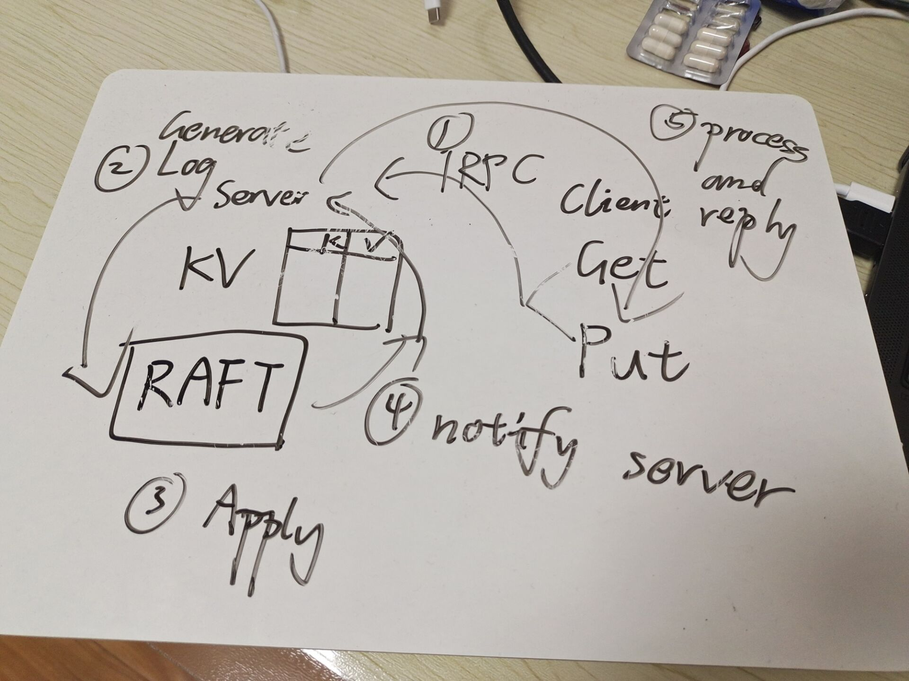

#### KVRaft

The labs of course MIT 6.824 2020.

#### Progress

- [x] MapReduce
- [x] Raft 
- [x] KV Storage Over Raft
- [x] Shared KV Storage Over Raft
- [x] Chanllenge 1
- [x] Chanllenge 2
#### Ideas

1. MapReduce: Following the MapReduce paper is ok

2. Raft: Following the Figure 2 is Raft paper strictly.

3. KVRaft: 

   

   

